  
  
  

## About

I'm a **Computer Science & Engineering student at UMaT** and a developer focused on turning ideas into polished digital products.

I work across **web, mobile, backend, real-time systems, and AI-powered tools** — with a particular interest in products that feel as good to use as they are to build.

- 🚀 Building and shipping products, not just demos
- 🌐 Full-stack web development
- 📱 React Native & Expo mobile development
- ⚡ Real-time experiences with WebRTC and Socket.IO
- 🤖 Exploring practical AI-powered applications
- 🇬🇭 Building from Ghana

## What I Build

<table>
<tr>
<td width="50%">

### 🌐 Web
Modern, responsive applications with strong UI and real product architecture.

`Next.js` `React` `TypeScript` `Tailwind`

</td>
<td width="50%">

### 📱 Mobile
Cross-platform mobile experiences designed around real users and real workflows.

`React Native` `Expo`

</td>
</tr>
<tr>
<td width="50%">

### ⚡ Real-time
Communication and interactive systems where latency actually matters.

`WebRTC` `Socket.IO` `Node.js`

</td>
<td width="50%">

### 🤖 AI & Computer Vision
Tools that combine software engineering with intelligent automation.

`Python` `OpenCV` `AI APIs`

</td>
</tr>
</table>

## Tech Stack

**Frontend**  
`Next.js` · `React` · `TypeScript` · `Tailwind CSS` · `Framer Motion` · `GSAP`

**Mobile**  
`React Native` · `Expo`

**Backend & Real-time**  
`Node.js` · `Python` · `Socket.IO` · `WebRTC` · `Express`

**Data & Platforms**  
`PostgreSQL` · `MongoDB` · `Appwrite` · `Supabase` · `Firebase`

**Tools**  
`Git` · `GitHub` · `Vercel` · `Render` · `OpenCV`

## Featured Projects

| Project | What it is | Stack |
|---|---|---|
| 🎥 **[Uni-Cam](https://uni-cam.vercel.app)** | University-focused random video communication platform | Next.js · WebRTC · Socket.IO |
| 🎶 **[Miuzicly](https://miuzicly.vercel.app)** | Music streaming & discovery experience with real-time playback | Next.js · TypeScript · Node.js |
| 🎵 **[Rabi Reigns](https://rabireigns.vercel.app)** | Artist website for a Ghanaian Afrobeat act | Next.js · Tailwind · GSAP |
| 🏢 **[SL](https://sl-jade.vercel.app)** | Production-focused corporate platform | React · Vite · Tailwind · Framer Motion |
| 🌐 **[Portfolio](https://danielstrevor.vercel.app)** | Interactive developer portfolio | Next.js · TypeScript · Tailwind |
| 🛡️ **FaceGuard** | Desktop face-recognition monitoring application | Python · OpenCV · dlib · SQLite |

## GitHub Activity

## Contribution Trail

**Build. Ship. Learn. Repeat.**

Built with 🖤 from Ghana 🇬🇭

